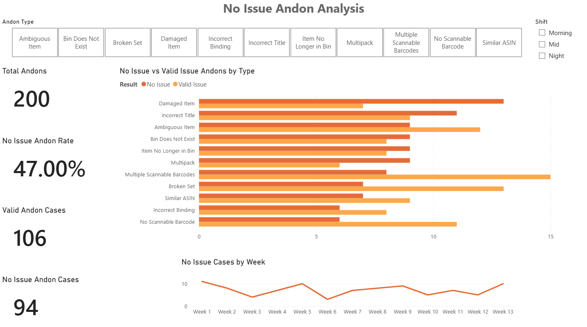

# ICQA Project: No Issue Andon Analysis
## Operational Data Analysis using Excel and Power BI (Based on Amazon MME1 experience)

## Project Overview
When counting inventory in an Amazon Fulfillment Center as an ICQA Team Lead, Associates (Counters) can raise "Andons" if they spot a problem with a bin or a product. However, I noticed many cases where the Problem Solver checked the Andon and found **no issue**, or a minor mistake that took less than 5 seconds to fix. This created unnecessary movement and wasted time in the department.

I launched this project to analyze historical Andon data, identify patterns, and find out where and why these incorrect Andons happened the most (across shifts, categories, and weeks).

*Note on Data Privacy & Portfolio Dataset:* Due to NDA and strict data privacy rules at Amazon, I cannot share the original operational datasets. To demonstrate my technical skills, I used a simulated dataset of 200 generated cases that mirrors the logic, categories, and patterns of the real-world problem.

*Real-World Impact:* While the project documentation and dashboard use simulated data for display purposes, the actual process I implemented on the floor led to measurable improvements. By analyzing the data weekly in Excel, I identified the top 10 associates with the highest error counts and shared these lists across all shifts for targeted coaching based on the Problem Solver feedback. Comparing the initial weekly metrics against the final week's data before my departure verified that this straightforward feedback loop was associated with a **~75% reduction in No Issue Andon volume over a 1 year period.**

---

## Tools Used & Skills Demonstrated
- **Excel:**
  - Data cleaning (created a unique Case_ID column for tracking and generated a numeric Week_Number column to enable weekly trend analysis).
  - Pivot Tables for rapid data exploration and verifying totals.
  - Data preparation
- **Power BI** (Built for this portfolio to visualize the operational dataset):
  - Importing and modeling the cleaned Excel dataset.
  - KPI reporting (creating a dedicated KPI card using a DAX measure to calculate the **No Issue Andon Rate %**).
  - Basic DAX measures
  - Building a clean visual dashboard to present the findings to the operational team.

---

## Key Findings from the 200 Analyzed Cases
Out of the **200 total Andon cases** tracked over a 13 week period, my analysis revealed that **94 cases were incorrect (No Issue Andons)**. This means the dashboard's main KPI card shows a **47% No Issue Andon Rate** – nearly half of the reported issues were false positives.

- **Shift Distribution:** Morning shift (35 cases) and Night shift (34 cases) generated a higher number of incorrect Andon reports compared to the Mid shift (25 cases).
- **Top Error Categories:** The two most common categories for incorrect Andons were **"Damaged Item"** (13 cases) and **"Incorrect Title"** (11 cases). This highlights which specific rules cause the most confusion among associates.
- **Associate Distribution:** While incorrect cases were spread across multiple individuals, a few associates had slightly higher counts (e.g., 6–7 cases over several months). However, considering the high volume of items counted by an associate over this timeframe, I recognized this reflects minor human error rather than a major individual performance issue. The findings suggest that the issue may be more process-related than individual.

---

## Practical Recommendations & Real-World Implementation
The Excel file contains the baseline recommendations I developed during the initial analysis. With my manager's approval, I transformed those insights into a simple weekly routine on the warehouse floor:

- **Reviewing Evaluation Criteria via Direct Feedback:** (Linked to Excel Recommendation #1) While the initial analysis highlighted "Damaged Item" and "Incorrect Title" as top problem areas, my practical solution covered all error categories. Every week, I extracted the top 10 associates with the highest overall error counts from my Pivot table and shared these lists across all shifts.
- **Reducing Inconsistencies through Problem Solver Notes:** (Linked to Excel Recommendation #2) I instructed Team Leads to use the exact comments left by the Problem Solvers to explain to the identified associates why their specific Andons were invalid. Showing them the actual result eliminated subjective guessing on the spot, regardless of the error type.
- **Maintaining the Weekly Routine & Measuring Impact:** (Linked to Excel Recommendation #3) I created and distributed the report every single week to ensure ongoing coaching for the associates across all shifts. Instead of tracking percentage changes weekly, I focused on maintaining this consistent routine. After about 1 year, just before my departure from the company, I compared the final weekly data against the original historical baseline in Excel. This final review verified that the sustained weekly feedback loop was associated with a **~75% reduction in No Issue Andon volume.**

---

## Dashboard Preview

---

## Files Included
* `no_issue_andon_analysis.xlsx` (Includes Cleaned Data, Data Cleaning steps, Pivot Table Analysis, and Key Findings based on the portfolio dataset)
* `no_issue_andon_analysis_dashboard.pbix` (The Power BI Dashboard file created to visualize the simulated metrics, featuring the KPI cards and trend charts)
